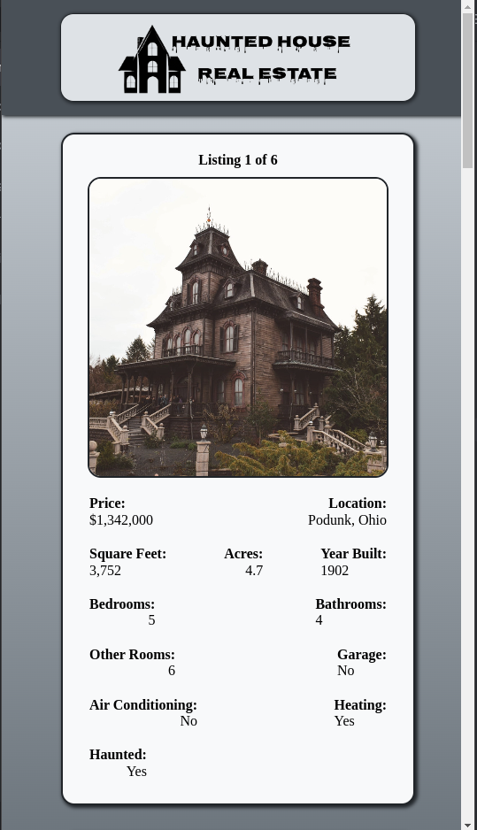
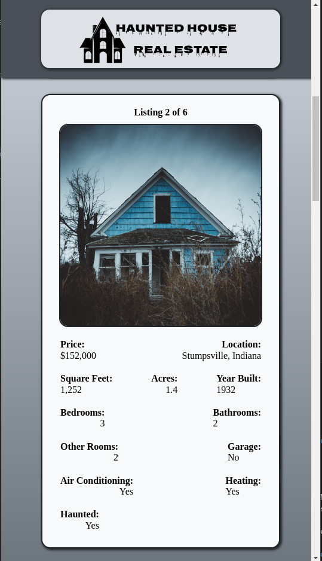
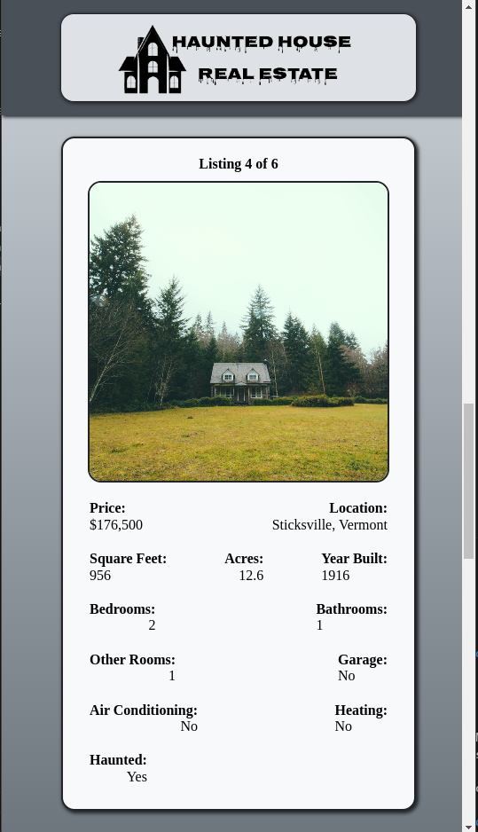
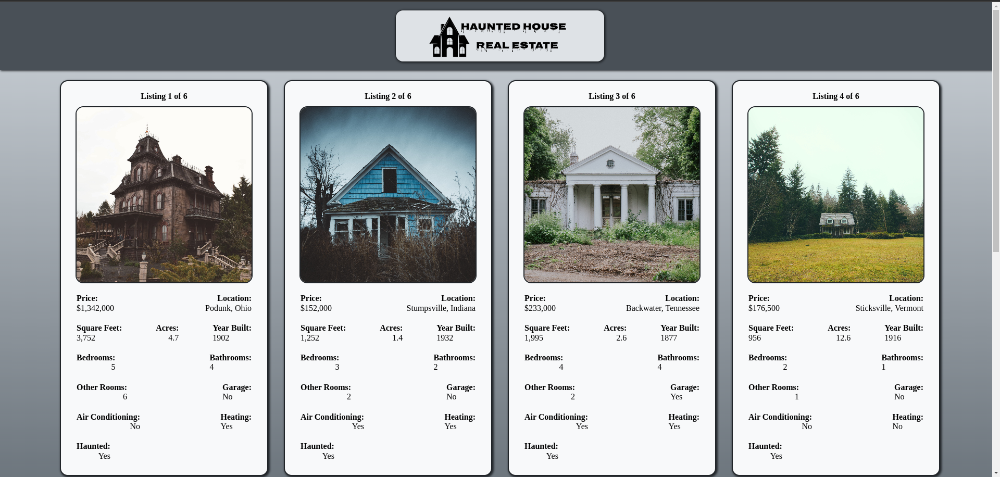
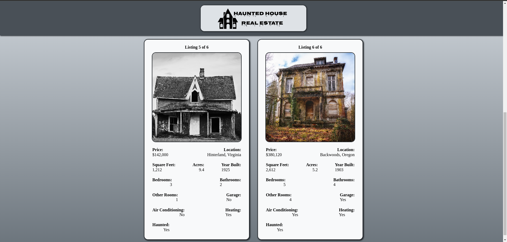
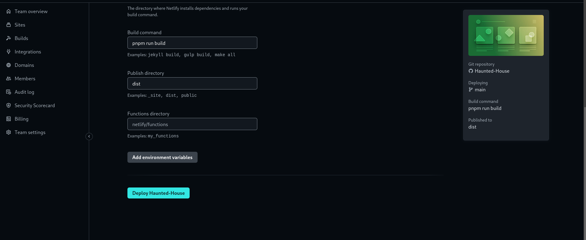

# HAUNTED HOUSES

https://haunted-houses.netlify.app/

Introducing the most captivating and immersive haunted houses you've ever encountered. Step into a world where fear and excitement intertwine, and embark on an unforgettable journey through our meticulously designed and masterfully crafted haunted houses. 

### Mobile











## Before you Begin 🛠 🔨

Write the following command in your terminal

```
$ npm install
$ npm run dev
````

```
$ pnpm install
$ pnpm run dev
```

## For cloning the project 🪛

```
# Clone this repository
$ gh repo clone MastooraTurkmen/Haunted-House

# Go inside the repository
$ cd haunted-hose
```

------

## Deployment  📥

1. How to deploy our project to netlify site?
2. I use [Netlify App](https://app.netlify.com/) for deploying my projects.
3. Go to Netlify site and select Add a new site.
4. From there select **_Deploy with Github_**.
5. Then write your project name and select it.
6. After selecting here you can see that the project **_Review configuration for Haunted-House_** and then select the **_Deploy Haunted-House_** Button.
  + 
  + 
7. Now your project is Live.


------

# React + Vite

This template provides a minimal setup to get React working in Vite with HMR and some ESLint rules.

Currently, two official plugins are available:

- [@vitejs/plugin-react](https://github.com/vitejs/vite-plugin-react/blob/main/packages/plugin-react/README.md) uses [Babel](https://babeljs.io/) for Fast Refresh
- [@vitejs/plugin-react-swc](https://github.com/vitejs/vite-plugin-react-swc) uses [SWC](https://swc.rs/) for Fast Refresh

------


## Author 👩🏻‍💻 

**Mastoora Turkmen**  
[LinkedIn](https://www.linkedin.com/in/mastoora-turkmen/)
[Github](https://github.com/MastooraTurkmen/) 
[Twitter](https://twitter.com/MastooraJ22)