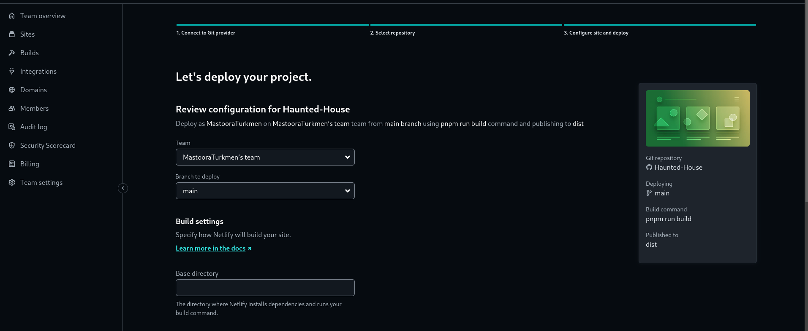
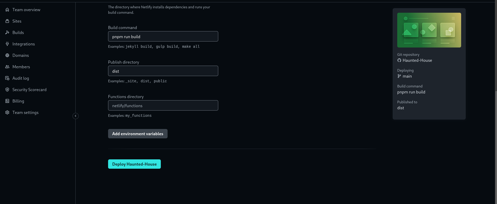

# HAUNTED HOUSES

## Before you Begin 🛠 🔨

Write the following command in your terminal

```
$ npm install
$ npm run dev
````

```
$ pnpm install
$ pnpm run dev
```

## For cloning the project 🪛

```
# Clone this repository
$ gh repo clone MastooraTurkmen/Haunted-House

# Go inside the repository
$ cd haunted-hose
```


## Deployment  📥

1. How to deploy our project to netlify site?
2. I use [Netlify App](https://app.netlify.com/) for deploying my projects.
3. Go to Netlify site and select Add a new site.
4. From there select **_Deploy with Github_**
5. Then write your project name and select it
6. After selecting here you can see that the project **_Review configuration for Haunted-House_** and then select the **_Deploy Haunted-House_** Button
  + 
  + 
7. Now your project is Live


